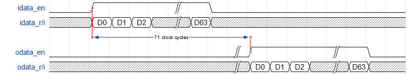

r22sdf
======

Implementation of pipeline FFT described in Verilog HDL.

* Radix-22 single-path delay feedback (R22SDF) architecture
* Scaled fixed-point arithmetic
* Synthesizable with FPGA implementation software

Interface
---------

	module FFT #(
	    parameter   WIDTH = 16
	)(
	    input               clock,      //  Master Clock
	    input               reset,      //  Active High Asynchronous Reset
	    input               idata_en,   //  Input Data Enable
	    input   [WIDTH-1:0] idata_r,    //  Input Data (Real)
	    input   [WIDTH-1:0] idata_i,    //  Input Data (Imag)
	    output              odata_en,   //  Output Data Enable
	    output  [WIDTH-1:0] odata_r,    //  Output Data (Real)
	    output  [WIDTH-1:0] odata_i     //  Output Data (Imag)
	);

Data must be input consecutively in natural order.
The result is scaled to 1/N and output in bit-reversed order.
The output latency differs depending on the transform size.
For 64-point FFT, it is 71 clock cycles.

*64-point FFT timing diagram*

Source Files
------------

There are two kinds of configurations.

* Basic configuration for small size FFT
* Resource saving configuration for large size FFT

In my environment, when the number of FFT points is greater than or equal to 256
 it is better to use the resource saving configuration.

For the basic configuration, use the following files.

	FFT.v
	SdfUnit.v
	SdfUnit2.v
	Butterfly.v
	DelayBuffer.v
	Multiply.v
	Twiddle.v

*FFT.v* and *Twiddle.v* must be created according to the number of FFT points
 and the data bit length.
*SdfUnit2.v* is required if the number of FFT points is not a power of 4.
To make a resource saving configuration, replace *SdfUnit.v* with *SdfUnit_TC.v*
 and add *TwiddleConvert4.v* or *TwiddleConvert8.v*.

*TwiddleConvert4* reduces the table size of *Twiddle* to 1/4.
Likewise, *TwiddleConvert8* reduces it to 1/8, but requires more additional logic
 than *TwiddleConvert4*.
*TwiddleConvert8* is used by default, but *TwiddleConvert4* may be better in some cases.

Architecture
------------

Radix-22 single-path delay feedback (R22SDF)
 is known as an efficient implementation of pipeline FFT.
There is radix-2 single-path delay feedback (R2SDF) in a similar architecture,
 but R22SDF uses fewer multipliers.

